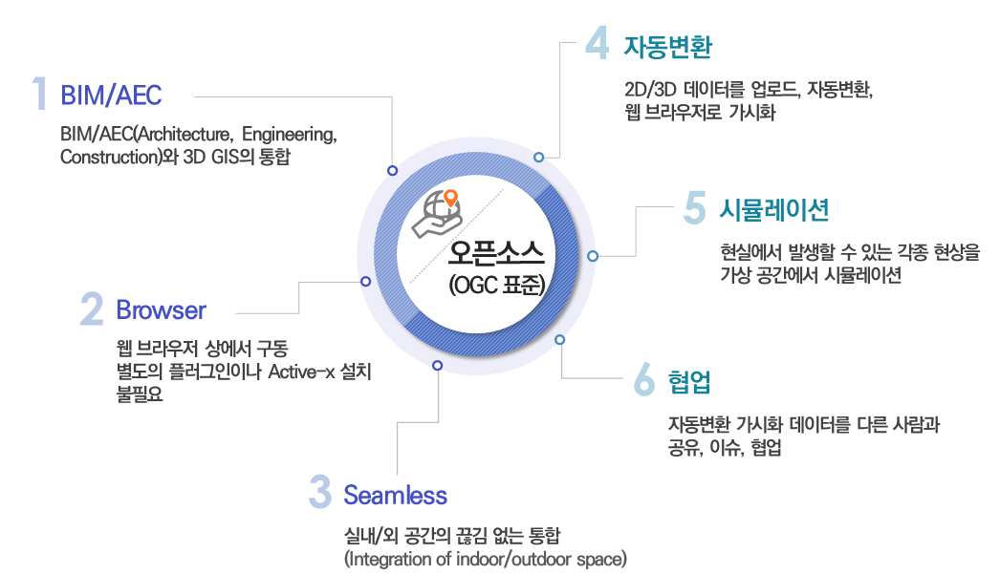
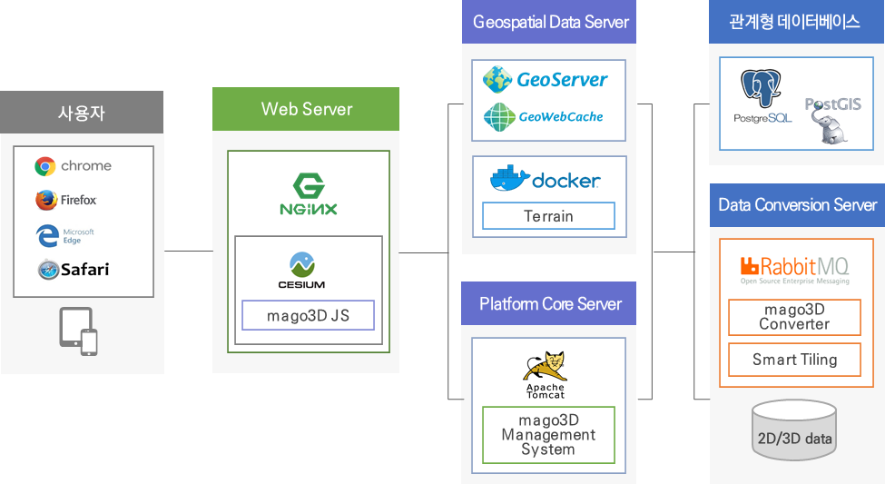
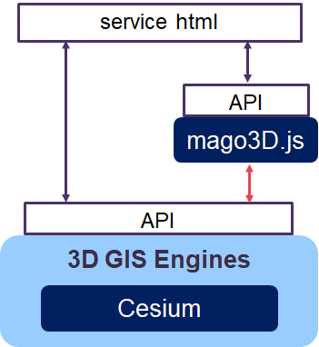
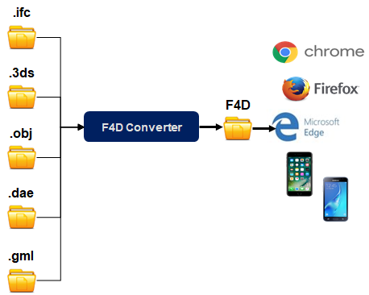
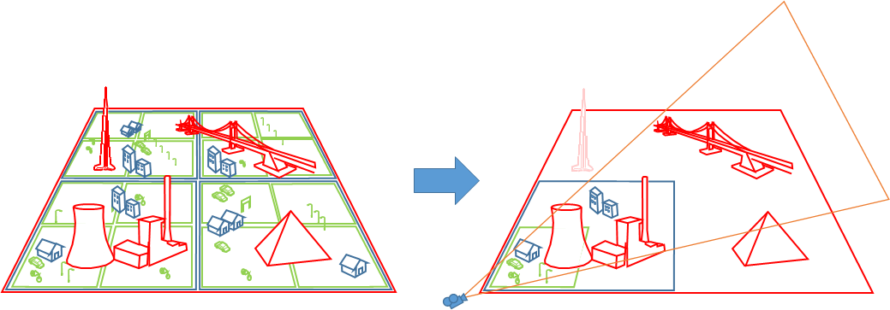

# mago3D 문서 작업 저장소
Repository for mago3D documents. 

## mago3D 소개 

### **1. mago3D 정의**

> 사용자가 초 대용량 3차원 BIM/AEC/GIS 데이터를 업로드, 자동변환, 웹 브라우저로 가시화, 공유, 협업하고 현실에서 발생할 수 있는 각종 현상을 가상공간에서 시뮬레이션 하는 디지털 트윈 플랫폼.

### **2. mago3D 특징** 

- 3D GIS 환경 위에서 실내외 공간의 끊김 없는 통합
- 웹 브라우저 상에서 구동, 별도의 add-on 이나 ActiveX 설치 필요 없음 
- 오픈소스기반 개발, 개발성과 확장성 확보
- 초대용량 3차원 파일의 효율적 관리 및 초고속렌더링 

### **3. 아키텍쳐**

### **4. mago3D 구성**

- **mago3d** [GitHub - Gaia3D/mago3d: mago3D 최신 버전](https://github.com/Gaia3D/mago3d) 
- **mago3d-js** [GitHub - Gaia3D/mago3djs: 3D Rendering Library](https://github.com/Gaia3D/mago3djs) 
- **mago3d-converter** [GitHub - Gaia3D/NewF4DConverter](https://github.com/Gaia3D/NewF4DConverter) 
- **mago3d-tiler** [GitHub - Gaia3D/SmartTiler](https://github.com/Gaia3D/SmartTiler) 

 

| **구성**             | **설명**                                                     |
| :------------------- | :----------------------------------------------------------- |
| **mago3d**           | mago3d 플랫폼 * 사용자/관리자 시스템으로 구성 * 데이터 변환 자동화 (3D/2D) * Rule-Based Management System * 스마트 타일링 * 시뮬레이션 * 대시보드, 사용자, Role, 메뉴 등 관리기능 * 시스템 환경 설정 * 사용자별 환경설정 |
| **mago3d-js**        | 3D 다중 블록 가시화를 위한 오픈소스 자바스크립트 라이브러리  |
| **mago3d-converter** | * 3D 형식(IFC, 3DS, OBJ, DAE, JT)을 mago3D 서비스 전용 포맷인 F4D로 변환 * 변환 과정에서 빠른 렌더링을 위해 데이터 크기 축소 및 사전 처리를 수행  |
| **mago3d-tiler**     | * mago3d 플랫폼에서 사용 가능한 스마트 타일 형태로 F4D를 타일링 * 전체 데이터를 불러오지 않고 화면에 들어오며, 카메라와의 거리를 따진 타일의 데이터만 호출  |

## mago3D 활용 가이드
### [mago3D 설치 가이드](./installation_guide.md)
  * [Windows](./windows_installation.md)
  * [CentOS](./linux_installation.md)
### [mago3D 개발자 가이드](./developer_guide.md)
### [mago3D 사용자 가이드](./user_guide.md)
