# 목차 

0. [mago3D 아키텍처 및 구성](#0-mago3d-아키텍처-및-구성)
1. [개발환경 구축]()
2. [프로젝트 구성]()
3. [DataGroup, DataInfo와  F4D와의 관계]()
4. [RabbitMQ 동작 이해하기]()
5. [3차원 데이터 자동 변환]()
6. [레이어 관리]()
7. [권한 관리]()
8. [정적 컨텐츠 갱신]()
9. [암호화]()
10. [메모리 캐시]()
11. [자바]()
12. [DB 규약]()
13. [코딩 규약]()
14. [빌드]()
15. [로깅]()
16. [Web/ WAS Server 차이점]()
17. [Web/WAS Server 연동 및 테스트]()
18. [Tomcat 설정]()
19. [서비스 등록]()
20. [Windows 서버 구축하기]()


## 0. [mago3D 아키텍처 및 구성](./README.md) 

## 1. 개발환경 구축

- java 설치
- docker-compose 로 개발환경을 구축하는 경우 geoserver, database, rabbitmq 설정은 skip
- intellij 에서 개발환경을 구축하는 경우 static resource 들을 build 없이 갱신하기 위하여 resource 경로를 file path 로 잡아 주기 때문에, 실행을 bootRun 으로 실행하거나 configuration 에 Working directory 를 **$MODULE_WORKING_DIR$** 로 설정해 주어야 한다.
- [설치 가이드](./installation_guide.md)


## 2. 프로젝트 구성

| **프로젝트명**      | **설명**                                                     |
| :------------------ | :----------------------------------------------------------- |
| common              | 암호화(보안), 통계모듈 등 공통 기능 관리                     |
| doc                 | Database(ddl, dml 등), Geoserver 관련 문서, Docker(dockerfile 등), 프로젝트 문서를 관리 |
| html                | html 디자인 파일 관리                                        |
| mago3d-admin        | 플랫폼(mago3D) 관리자                                        |
| mago3d-user         | 2차원/3차원 공간데이터 조회, 시뮬레이션 연동 등등            |
| mago3d-converter    | 3차원 공간정보 자동화 관리                                   |
| mago3d-tiler        | 스마트 타일 자동화 관리                                      |
| mago3d-sensorthings | 센서 데이터 자동화 관리                                      |


## 3. DataGroup, DataInfo와 F4D의 관계

###  경로 설정파일

/src/resources/mago3d.properties

### 기본 경로

| **Path**  | **관리자**  | **사용자**    |
| :-------- | :---------- | :------------ |
| F4D       | /infra/data | /service/data |
| SmartTile | /infra/tile | /service/tile |

- 관리자에서 등록하는 데이터는 **infra/data** 를 기본 path 로 사용하고, 
- 사용자에서 등록하는 데이터는 **service/data** 를 기본 path 로 사용한다.
- 관리자/사용자 모두 기본적으로 **basic** 이라는 기본 그룹을 가지고,
- **기본 path/user_id/data_group_key/** 경로에 변환된 F4D 데이터가 저장된다.

### F4D 데이터 저장 경로 (전체)

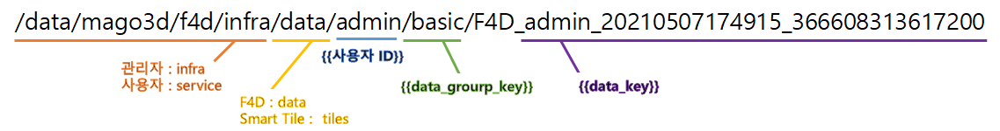

### F4D 데이터 저장 경로 (상세)

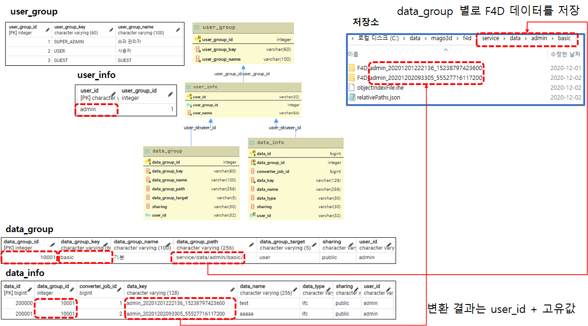

 

## 4. RabbitMQ 동작 이해하기

###   **RabbitMQ**

[RabbitMQ](https://www.rabbitmq.com/)는 Erlang으로 [AMQP](https://ko.wikipedia.org/wiki/AMQP)를 구현한 메시지 브로커 시스템이다.

### AMQP(Advanced Message Queuing Protocol)

- 클라이언트가 메시지 미들웨어 브로커와 통신할 수 있게 해주는 **메세징 프로토콜**
- RabbitMQ에서 중요한 개념으로 **Producer, Consumer, Queue, Exchange, Binding**이 있다.

| **항목**     | **설명**                                                     |
| :----------- | :----------------------------------------------------------- |
| **Producer** | * 메세지를 생성하고 발송하는 주체<br />* 주의해야 할 점은 Producer는 Queue에 직접 접근하지 않고, 항상 Exchange를 통해 접근하게 된다. |
| **Exchange** | * Producer들이 발송한 메세지들을 어떤 Queue들에게 발송할지 결정하는 객체<br />* Exchange는 4가지 타입이 있으며, 일종의 라우터 개념이다. |
| **Binding**  | * Exchange에게 메세지를 라우팅 할 규칙을 지정하는 행위<br />* 특정 조건에 맞는 메세지를 특정 큐에 전송하도록 설정할 수 있는데, 이는 해당 Exchange 타입에 맞게 설정되어야 한다. <br />* Exchange와 Queue는 M:N binding이 가능합니다. |
| **Queue**    | * Producer들이 발송한 메세지들이 Consumer가 소비하기 전까지 보관되는 장소<br />* Queue는 이름으로 구분되는데, 같은 이름과 같은 설정으로 Queue를 생성하면 에러 없이 기존 Queue에 연결되지만, 같은 이름과 다른 설정으로 Queue를 생성하려고 시도하면 에러가 발생합니다. |
| **Consumer** | * 메세지를 수신하는 주체<br />* Consumer는 Queue에 직접 접근하여 메세지를 가져온다. |


- 메시지를 발행하는 **produce**r 에서 **broker** 의 **exchange** 로 메시지를(**routing key**) 전달하면, **binding** 규칙에 의해 연결된 **queue** 로 메시지가 복사된다.
- 메시지를 받아가는 **consumer** 에서는 브로커의 **queue** 를 통해 메시지를 받아가서 처리한다.

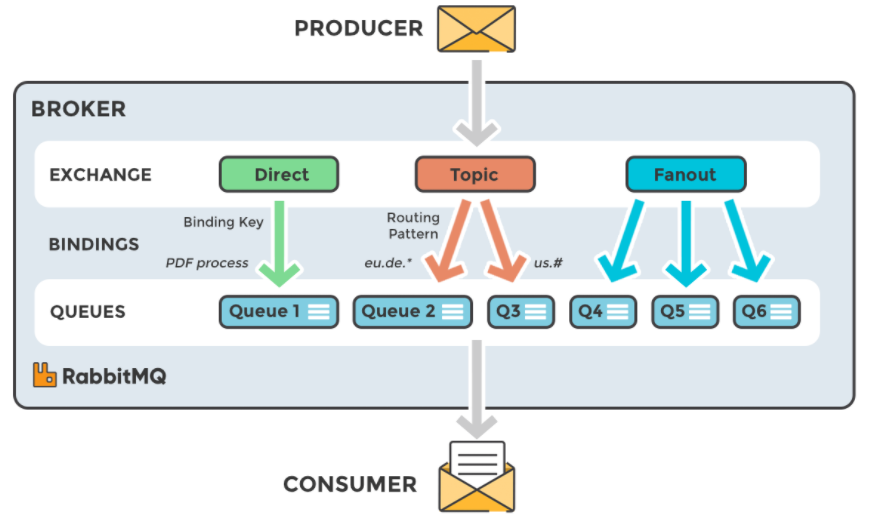

- Exchange에는 4가지 타입이 있는데, 가 타입별 특징은 다음과 같다.

| **타입** | **설명** | **특징** |
| :------- | :------- | :------- |
|          |          |          |

| **타입**    | **설명**                                                     | **특징**  |
| :---------- | :----------------------------------------------------------- | :-------- |
| **Direct**  | Routing key가 **정확히 일치**하는 Queue에 메세지 전송        | Unicast   |
| **Topic**   | Routing key **패턴이 일치**하는 Queue에 메세지 전송          | Multicast |
| **Headers** | **[ key - value ]** 로 이루어진 header 값을 기준으로 일치하는 Queue에 메세지 전송 | Multicast |
| **Fanout**  | 해당 Exchange에 등록된 **모든** Queue에 메세지 전송          | Broadcast |

### 기타 설정값

- durability
  - 브로커가 재시작 될 때 남아 있는지 여부
  - durable : 재시작해도 유지 가능
  - transient : 재시작하면 사라짐
-  auto-delete
  - 마지막 queue 연결이 해제되면 삭제

## 5. 3차원 데이터 자동 변환

### 흐름도

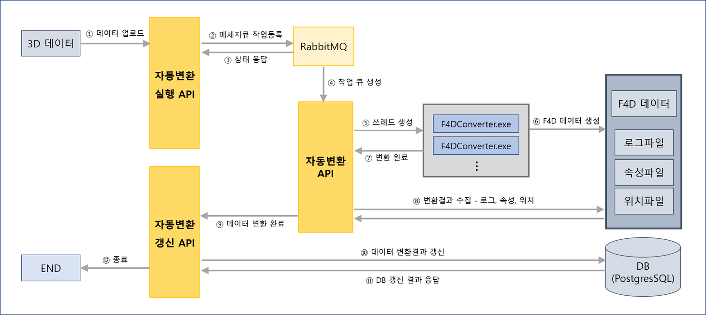

 

 데이터 업로드

 메세지큐 작업등록 및 상태응답

 자동변환 API(mago3d-converter)가 RabbitMQ의 Queue를 보고 있다가 Queue에 메세지가 들어올 경우 F4DConverter에 변환을 요청

 F4DConverter에서 변환이 완료되면 자동변환 API(mago3d-converter)로 응답을 보내고,

응답을 받은 API에서 변환결과(로그, 속성, 위치)를 수집한다.

 

속성정보, 위치정보가 있을 경우에만 속성, 위치 파일을 생성

위치파일 : 변환된 F4D 디렉토리 하위에 `lonsLats.json`

속성파일 : 변환된 F4D 디렉토리 하위에 `attributes.json`

 

로그 파일은 항상 생성

로그파일 : `ConverterServiceImpl`, `executeConverter`

 

 데이터 변환결과 갱신 

 

## 6. 레이어 관리 

- 레이어 관리는 mago3D 관리자에서만 등록 및 수정 삭제가 가능하고, 사용자에서는 관리자가 등록한 레이어들을 가시화만 해준다.
- vector 
  - 현재 업로드 가능 대상은 Shape 파일이다. 
  - shape 파일 등록 시 ogr2ogr 을 사용하기 때문에 gdal 에 의존적이다. 
- 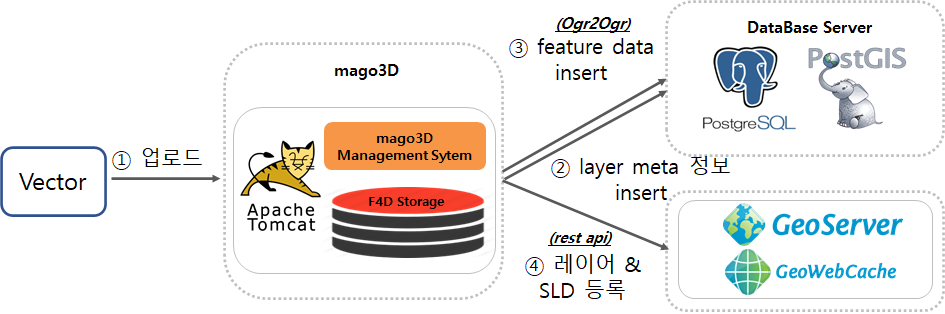
- raster 
  - raster 데이터는 대용량인 경우가 많아서 관리자에서 별도로 업로드 하지 않고, 직접 storage 에 있는 데이터를 geoserver 로 등록 후 관리자에서 관리한다. 
  - geoserver 에 등록된 레이어중 선택한 레이어를 서비스 대상 레이어로 설정 할 수 있고, wms 외에캐시 사용 유무를 설정하여 geowebcache 를 사용할 수 있다.
- 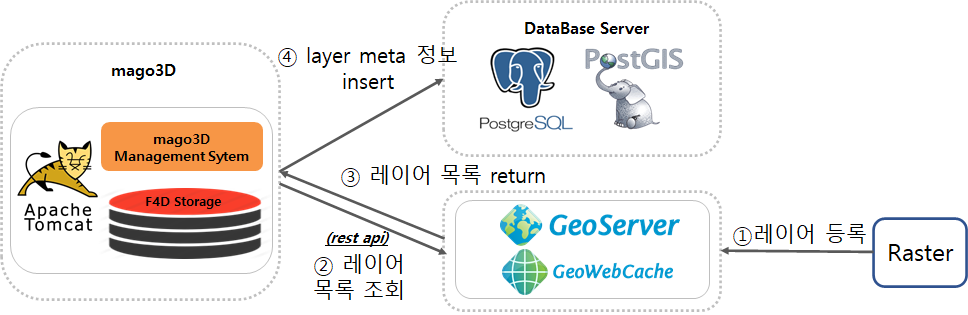


## 7. 권한 관리

모든 사용자는 그룹을 가지고 있고 해당 그룹에 따라 접근 가능한 메뉴와 권한이 결정된다. 

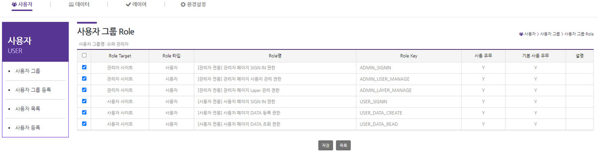

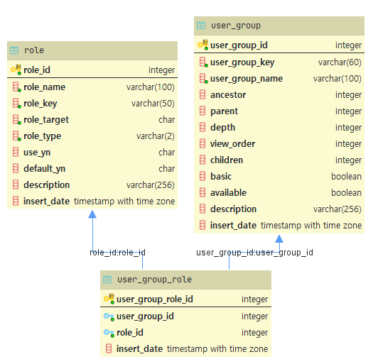


## 8. 정적 컨텐츠 갱신

- 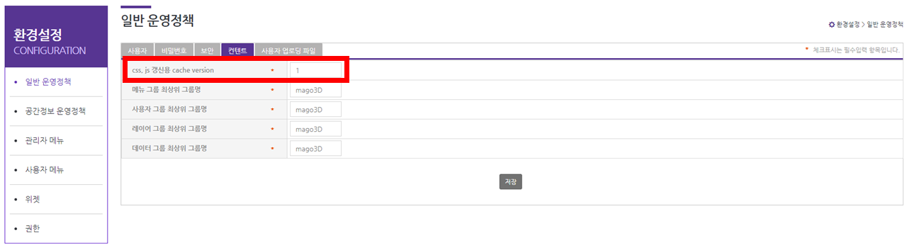

- 정적인 컨테츠인 css, js 등은 브라우저가 캐시를 해두기 때문에 새로운 내용이 브라우저 캐시를 지우기 전까지는 반영되지 않는다. 

- 컨테츠 경로에 쿼리스트링을 ?version=20201202123453 와 같이 timestamp 를 붙여도 되지만 이렇게 할 경우 컨텐츠 내용에 변경사항이 없을 때도 캐시된 컨텐츠가 아닌 새로운 컨텐츠를 요청후 가져온다.

- 컨텐츠에 변경이 있을 경우에만 캐시를 갱신하기 위해 다음과 같이 경로에  **cacheVersion** 을 붙이고 필요한 경우에만 갱신한다.

  ```
  <script type="text/javascript" th:src="@{/js/{lang}/layer.js(lang=${lang},cacheVersion=${contentCacheVersion})}"></script>
  ```

  

## 9. 암호화 

1) jdbc connection 정보 및 각종 계정정보 암호화

   –  seed 암호화 알고리즘을 사용.(128비트 암호화키를 사용하는 블록 암호화 알고리즘)
   –  16 바이트의 key 를 사용하며, 해당 **key 는 프로젝트 별로 다르게 해야한다.** 프로젝트마다 key 를 같게 한다면 하나의 key 를 가지고 다른 프로젝트까지 복호화 할 수 있기 때문이다.

   – application.properties 의 db connection 정보를 암호화 복호화 할때는  common 프로젝트의
   gaia3d/security 패키지의 CryptTest 의 테스트를 수행해서 암복호화 한다. 

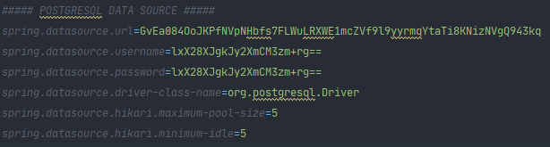

2) 로그인 사용자 패스워드 암호화 

​    –  사용자 정보를 암호화 할때는 mago3d-admin 프로젝트의 gaia3d.utils 패키지의 PasswordTest 의
   bCryptPasswordEncoderTest 테스트를 수행해서 암호화 한다. 

​    – spring security 의 `BCryptPasswordEncoder` 를 사용하여 암호화 하여 저장한다. 
​    –  BCryptPasswordEncoder 의 **strength 를 10 이상으로 할 경우 속도가 느려지므로 주의.**


## 10. 메모리 캐시

- policy, geopolicy, userGroup, menu ,role 에 대해 메모리 캐시를 사용한다. 
- 관리자에서 위 항목에 대해 변동 사항이 있을 경우 해당 내용을 사용자 애플리케이션으로 전파해 주기 때문에  **위 항목들에 대해 갱신할 경우에는 사용자 애플리케이션도 기동중이어야 한다.**
- **애플리케이션이 실행될 때 db 에서 해당 정보들을 가져와서 메모리에 담기 때문에 애플리케이션이 기동중인 상태에서 해당 내용들을 수동으로 갱신 했을 경우에는 애플리케이션을 재기동해야 한다.**


## 11. 자바

- **패키지**

–  api : 외부에서 사용할 api. 로그를 남겨야 할 경우 APIController 인터페이스를 상속하여 사용

– controller

– rest : RestController

– view : Controller

– interceptor : locale, login 등에 관련된 각종 인터셉터 . 
  ConfigInterceptor : view 에서 사용할 정보를 바인딩(메뉴, contentVersion 등)

- **resources**

– develop : 개발 서버용 설정 파일 

– messages : 다국어 처리를 위한 message properties

– static

– externlib : 외부 라이브러리

- logback.xml : 상세 로그를 보고 싶은 경우 

```
logger name="org.springframework" 값을 "org.springframework.web" 으로 변경
```

- **문법**
  – 트랜잭션 관리
     읽기와 쓰기, 수정, 삭제를 분리. @Transactional , @Transactional(read-only)

  – 단일 트랜잭션의 경우 Controller 에서 Service 계층을 호출할때 여러번 호출 되어서는 안됨.
     복잡한 로직의 경우 Service 계층에서 private 메소드 등으로 분리
  – 서비스 계층 예외 처리의 경우 spring 은 runtimeException 만 rollback을 하므로
     기타 예외의 경우 rollback-for 를 명시적으로 사용하거나, try, catch 구문에서 RuntimeException 으로변환해서 throw

     예) 게시판 목록, 게시판 상세, 첨부 파일
  –  코드값의 경우  enum을 사용하고, 각 도메인에서 사용하는 enum은 도메인 안에 포함하고, 공통의 경우 별도 파일로 분리. 현재 작업 진행중.
  – 날짜 관련 부분은 Calendar, Date 보다 LocalDateTime을 사용.
  – API 및 JSON Response 결과값의 경우 LocalDateTime 값이 제대로 표시되지 않음.
     viewInsertDate 를 사용하여 꼼수 처리중. 추후 개선 예정
  – foreach 의 경우 stream 사용, 성능이 느려지는 문법 사용시 주의.
  – HA Tomcat Clustering 으로 서버간 세션 공유 및 네트웍 통신 데이터의 경우 Serializable 을 구현
  – 다국어 처리를 위해 서버 메시지의 경우 message.properties, client 의 경우 message.js 파일에 작성.
     서버 처리가 힘든 경우 json id 를 이용하여, message.js 파일과 연동 

- 보안

  - Spring Security 적용 하지 않음. Role 부분 확장에 제약이 있어 추후 적용 예정
  - SQL Injection 의 경우 XSSFilter를 사용하는 OWASP Antisamic 이나 NHN Lucy 적용 예정

- Spring Boot

  - Runnable jar 가 개발시에는 편한데…. 고객사에서 설정(경로, ip) 등을 바꿔야 할 경우와

    이중화 이슈가 있어서…. 전부 war 로 변경할려고 함


## 12. DB 규약

- pk 가 되는 칼럼명은 테이블명_id 로 사용 

- Fk 는 개발 편이성을 위해 운영전 반영

- data 건수가 많을 경우 파티션 사용(30년 기준 100만 단위가 넘는 데이터)
    **pg12 기준 enable_partition_pruning = on 으로 설정해야 적용됨**

- 30년 기준, 약 10억건이 넘어가는 데이터에 대해서는(long type) bigint 로 사용

- 통계성 데이터의 경우, 최적화를 위해 중복 컬럼 허용
  년, 월, 일, 주 등은 insert_date 와 중복이 되나 미리 계산하여 저장

- 통계성 데이터를  실시간 표시해야 하는 이슈가 있는 경우 람다 아키텍처 사용

- 경도, 위도, 높이의 경우, Geometry(POINT, 4326), Numeric 타입(Altitude) 로 저장

-  시간 타입의 경우 timestamp with time zone 사용

  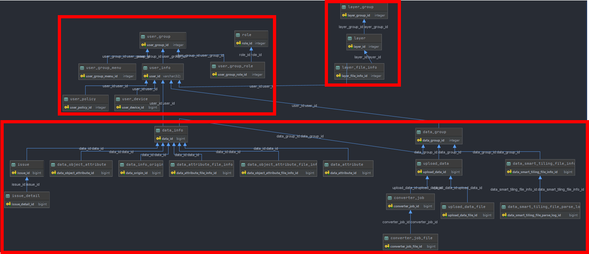


## 13. 코딩 규약

- **java**
  – e.printStackTrace를 출력 하고 싶은 경우는 `LogMessageSupport.printMessage(exception);`를 사용할것

  - 각 기능별 권한 사용의 경우 Controller 의 roleValidator를 참조하여 작성
  - form tag 가 전송되는 페이지에는 

  `SQLInjectSupport.replaceSqlInection` 를 맨 처음 실행.(보안 감사)

  - Rest API(Http API) 나 Ajax 통신의 Return 값으로 ResponseEntity를 던졌으나 Client 단에서

    예외 처리 등의 어려움이 있어서…. Map 안에 고정 키 값을 가지는 형태로 변경함

- **FrontEnd**

  – thymeleaf 코딩 규약 : [Thymeleaf 형식](https://gaia3d.atlassian.net/wiki/spaces/project/pages/32309256) 

  – handlebar.js **:** thymeleaf 사용시 server 와  view 가 강하게 결합되기 때문에 사용하지 않고 동적인 컨텐츠를 랜더링 하기 위해 사용([handlebar.js 규칙](https://gaia3d.atlassian.net/wiki/spaces/project/pages/28049409) )

  - 웹 접근성 준수
  - 다국어 처리를 위한 폴더 분리.
  - admin 페이지와 user 페이지에서 같은 이름의 js, css 파일을 사용하지 말것. 캐싱이 남음

- **mybatis** 

– 예약어는 대문자로, SQL 첫 문장에는 /* 호출하는 sql Id */ 를 작성

– SELECT , INSERT, UPDATE, DELETE 순으로 작성

– parameterType, resultType 에 map은 사용하지 말것. int, long, string 등은 기본 alias 사용

– 다음의 들여쓰기 규칙을 공통으로 사용 

```
UPDATE table 
SET
  column = ${value};
  
INSERT INTO table (
  column1, column2.....
) VALUES (
  value1, value2...
)

SELECT 
  칼럼
FROM
WHERE
ORDER BY
```


## 14. 빌드 

