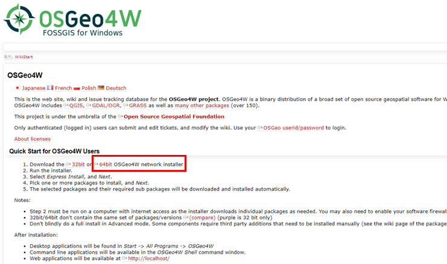
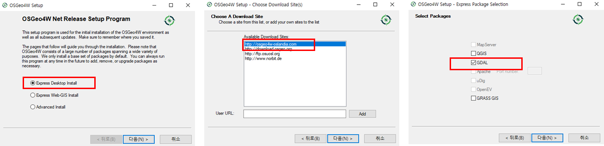
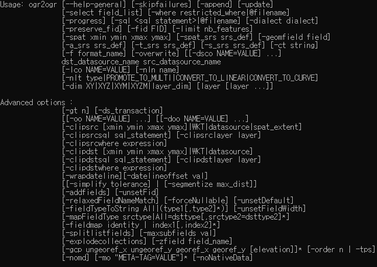
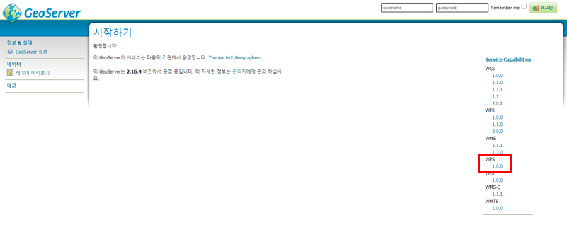
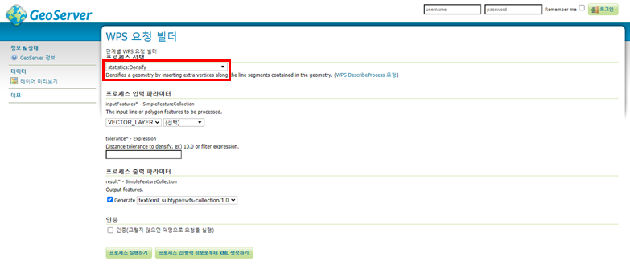
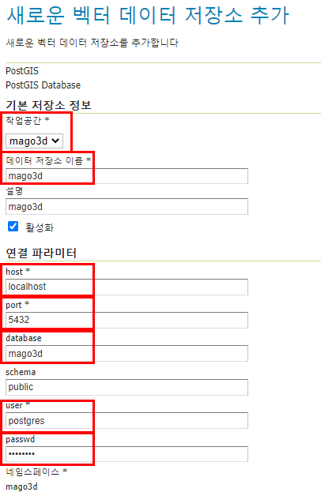

## 1. Java
### 1) Java 설치

- 자바설치 홈페이지(https://jdk.java.net/archive/)에 접속하여 Java를 구동하기 위한 환경에 해당하는 파일을 내려받는다.
- 내려 받은 압축 파일을 설치할 폴더에 압축 해제한다.


### 2) Java 환경변수 설정

- [제어판] → [시스템 및 보안] → [시스템] 또는 [내 PC]의 [속성]을 클릭 한 후, [고급 시스템 설정]을 클릭한다.

- [시스템 속성]의 [고급]탭 화면에서 [환경 변수]를 클릭한다.

- [환경변수] 화면에서 [새로 만들기]를 클릭하여, 변수 이름과 변수 값 입력란에 **JAVA_HOME**과 Java의 경로를 설정한다.
- Java 설치 경로를 설정 한 후, **시스템 변수의 [Path] 변수**를 선택하고 [편집] 버튼을 클릭한다.
- 제일 앞쪽에 **%JAVA_HOME%\bin;**을 입력하고 저장한다.


 

### 3) Java 설치 확인

- 명령 프롬프트 창을 실행시켜 아래와 같이 명령어 실행

```
1java -version
```


## 2. PostgreSQL/PostGIS
### 1) PostgreSQL 설치

- PostgreSQL 홈페이지(https://www.postgresql.org/)에 접속하여, Windows용 설치 파일을 내려 받는다 (https://www.enterprisedb.com/downloads/postgres-postgresql-downloads)


- 내려 받은 파일을 실행하여, PostgreSQL을 설치한다.

- 폴더 버튼을 클릭하고 설치 할 경로를 지정한다.
- 설치 항목에 Stack Builder 는 선택하지 않는다. 

- Password와 Retype password를 “postgres”로 설정한다.

- 포트(5432) 및 지역(Korea)을 설정한다.


 

### 2) PostGIS 설치

- postGIS 설치 방법으로는 postgresql 설치 후 stack builder를 통해 설치 하거나 직접 인스톨러를 실행하는 방법이 있는데 후자로 진행하도록 한다. stack builder를 통한 설치는 종종 오류가 발생하고 인터넷이 되지 않는 환경을 고려했을 때는 인스톨러를 통한 설치가 안전하다. ([http://download.osgeo.org/postgis/windows/pg12/](http://download.osgeo.org/postgis/windows/pg11/))
- 여기서는 [postgis-bundle-pg12x64-setup-3.0.2-1.exe](http://download.osgeo.org/postgis/windows/pg12/postgis-bundle-pg12x64-setup-3.0.2-1.exe) 버전을 다운받는다.
- 내려 받기가 완료되면 PostGIS 설치를 진행할 수 있다.


### 3) PostgreSQL 설정

- 파티션 설정을 위해서 postgresql.conf 설정 파일의 “enable_partition_pruning = on”의 주석을 해제한다. 

- postgresql.conf 파일은 윈도우 기준으로 기본으로 설치시 **C:\Program Files\PostgreSQL\12\data** 경로에 위치하며, 설정파일 수정후에는 postgresql 서비스를 재시작해야한다.

  

   

### 4) 데이터 베이스 생성

- psql 또는 PgAdmin을 사용하여 데이터베이스에 연결한 후, 아래와 같이 데이터베이스를 생성한다.

  ```
  CREATE DATABASE mago3d
  WITH OWNER = postgres
       ENCODING = 'UTF8'
       TEMPLATE = template0
       TABLESPACE = pg_default
       LC_COLLATE = 'C'
       LC_CTYPE = 'C'
       CONNECTION LIMIT = -1;
  ```

### 5) PostGIS 활성화

- psql 또는 PgAdmin을 사용하여 생성한 데이터베이스에 연결한 후, 다음 SQL을 실행한다.

  ```
  CREATE EXTENSION postgis;
  ```

- PostGIS 설치 확인
  ```
  SELECT postgis_version();
  ```
## 3. GDAL
### 1) GDAL 설치

- gdal을 설치하는 이유는 shape 파일을 db에 insert할 때 ogr2ogr을 사용하기 위함인데, gdal만 단독으로 설치하거나 qgis를 설치하여 gdal path를 잡아주는 방법이 있다.

- GDAL을 설치하기 위해 홈페이지(https://trac.osgeo.org/osgeo4w/)에 접속한다.

- Download the [32bit] 0r [64bit]에서 [64bit]를 선택하여 해당 파일을 내려 받는다.

  )

   

- 내려 받은 파일을 실행하여, 아래와 같은 설치 창이 생성된다.

- GDAL을 제외한 QGIS/GRASS GIS는 필요하면 체크하여도 무관하다.



### 2) GDAL 환경변수 설정

- [제어판] → [시스템 및 보안] → [시스템] 또는 [내 PC]의 [속성]을 클릭 한 후, [고급 시스템 설정]을 클릭한다.

- [시스템 속성]의 [고급]탭 화면에서 [환경 변수]를 클릭한다.
- **사용자 변수의 [Path] 변수**를 선택하고 [편집] 버튼을 클릭한다.

- [새로 만들기] 버튼을 클릭하여, **C:\OSGeo4W64\bin;**을 추가한다.
- **QGIS를 설치 후 환경변수를 추가할때는 qgis\bin 경로를 추가한다.**

### 3) GDAL 설치 확인

- 명령 프롬프트 창을 실행시켜 아래와 같이 명령어 실행하여 ogr2ogr 이 정상적으로 환경 변수로 등록되었는지 확인한다.

  ```
  ogr2ogr
  ```

  

- **환경변수를 등록한 후에는 was가 실행중이라면 재기동해야 등록한 환경변수가 적용되므로 주의해야한다. cmd 창역시 환경변수를 등록후에는 새로운 cmd 창에서 확인하도록 한다.**


## 4. GeoServer
### 1) GeoServer 설치

- GeoServer 홈페이지(http://geoserver.org/release/maintain/)에 접속하여, Tomcat에 war형태로 올려서 서비스하기 위해 Web Archive 버전을 내려 받는다.
- 내려받은 파일을 압축해제 후, geoserver.war파일을 톰캣의 webapp밑에 압축을 해제한다.

### 2) WPS Extensions

- GeoServer 버전에 맞는 플러그인을 내려 받는다.

https://sourceforge.net/projects/geoserver/files/GeoServer/2.16.4/extensions/geoserver-2.16.4-wps-plugin.zip/download

- gs-web-wps-2.16.4.jar

- gs-wps-core-2.16.4.jar

- gs-process-geometry-22.4.jar

- gt-xsd-wps-22.4.jar

- net.opengis.wps-22.4.jar

- serializer-2.7.2.jar

- 압축을 풀고, .jar 파일들을 Geoserer의 WEB-INF/lib 폴더에 복사하여 붙여 넣는다.

- GeoServer 재시작 후, 서비스 항목에 WPS 확인한다.



### 3) OpenGXT + GeoTools Extentions

- GeoServer 버전에 맞는 플러그인을 내려 받는다.

https://sourceforge.net/projects/mango-spatialstatistics/files/GeoServer/

- gs-wps-spatialstatistics-2.16-SNAPSHOT.jar

- gt-process-spatialstatistics-22-SNAPSHOT.jar

- 압축을 풀고, .jar 파일들을 Geoserer의 WEB-INF/lib 폴더에 복사하여 붙여 넣는다.

- GeoServer 재시작 후, 바인딩된 WPS 프로세스 확인

- GeoServer 관리자 페이지 → 데모 → WPS 요청 빌더



 

### 4) CORS 설정

- 톰캣의 web.xml에 다음과 같이 설정한다.

  ```
  <filter>
      <filter-name>CorsFilter</filter-name>
      <filter-class>org.apache.catalina.filters.CorsFilter</filter-class>
      <init-param>
          <param-name>cors.allowed.origins</param-name>
          <param-value>*</param-value>
      </init-param>
      <init-param>
          <param-name>cors.allowed.methods</param-name>
          <param-value>GET,POST,HEAD,OPTIONS,PUT</param-value>
      </init-param>
      <init-param>
          <param-name>cors.allowed.headers</param-name>
          <param-value>*</param-value>
      </init-param>
      <init-param>
          <param-name>cors.exposed.headers</param-name>
          <param-value>Access-Control-Allow-Origin,Access-Control-Allow-Credentials</param-value>
      </init-param>
      <init-param>
          <param-name>cors.preflight.maxage</param-name>
          <param-value>10</param-value>
      </init-param>
    </filter>
  ```

### 5) 작업공간 및 저장소 생성

- GeoServer 관리자 페이지 → 데이터/작업공간 → **새로운 작업공간 추가하기**

```
이름 : mago3d
네임스페이스 URI : http://www.gaia3d.com
기본 작업공간으로 설정하기 체크
```

- GeoServer 관리자 페이지 → 데이터/저장소 → 새로운 저장소 생성하기 → PostGIS

- postgresql 설치 후 생성한 database정보를 적어주는데 postgis extension을 설치하지 않으면 저장소 등록이 되지 않으므로 꼭 생성한 db에 posgis extension을 설치해야 한다.

  
## 5. F4D Converter
## 6. RabbitMQ
## 7. 기본 테이블 생성 및 패스워드 업데이트
## 8. 설정
## 9. 레이어 업로드 테스트
## 10. 3D 데이터 업로드 테스트
