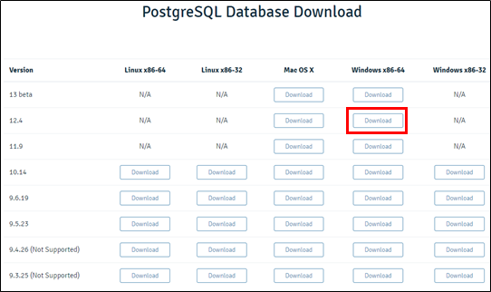
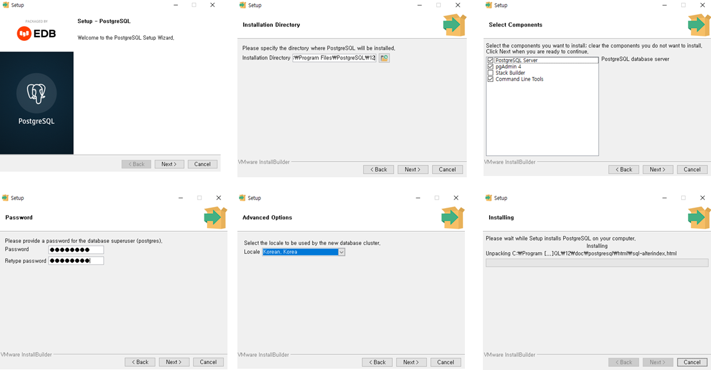
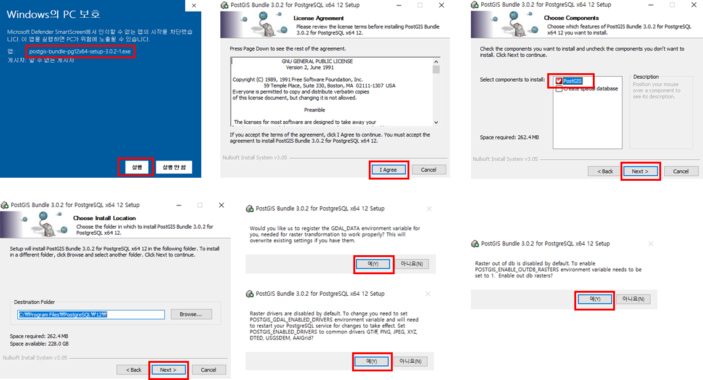
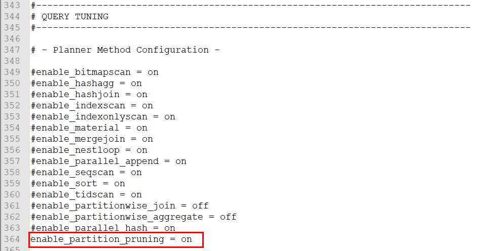

### 1. Java
### 1) Java 설치

- 자바설치 홈페이지(https://jdk.java.net/archive/)에 접속하여 Java를 구동하기 위한 환경에 해당하는 파일을 내려받는다.
- 내려 받은 압축 파일을 설치할 폴더에 압축 해제한다.


### 2) Java 환경변수 설정

- [제어판] → [시스템 및 보안] → [시스템] 또는 [내 PC]의 [속성]을 클릭 한 후, [고급 시스템 설정]을 클릭한다.

- [시스템 속성]의 [고급]탭 화면에서 [환경 변수]를 클릭한다.

- [환경변수] 화면에서 [새로 만들기]를 클릭하여, 변수 이름과 변수 값 입력란에 **JAVA_HOME**과 Java의 경로를 설정한다.
- Java 설치 경로를 설정 한 후, **시스템 변수의 [Path] 변수**를 선택하고 [편집] 버튼을 클릭한다.
- 제일 앞쪽에 **%JAVA_HOME%\bin;**을 입력하고 저장한다.


 

### 3) Java 설치 확인

- 명령 프롬프트 창을 실행시켜 아래와 같이 명령어 실행

```
1java -version
```


### 2. PostgreSQL/PostGIS
### 1) PostgreSQL 설치

- PostgreSQL 홈페이지(https://www.postgresql.org/)에 접속하여, Windows용 설치 파일을 내려 받는다 (https://www.enterprisedb.com/downloads/postgres-postgresql-downloads)



- 내려 받은 파일을 실행하여, PostgreSQL을 설치한다.

- 폴더 버튼을 클릭하고 설치 할 경로를 지정한다.
- 설치 항목에 Stack Builder 는 선택하지 않는다. 

- Password와 Retype password를 “postgres”로 설정한다.

- 포트(5432) 및 지역(Korea)을 설정한다.



 

### 2) PostGIS 설치

- postGIS 설치 방법으로는 postgresql 설치 후 stack builder를 통해 설치 하거나 직접 인스톨러를 실행하는 방법이 있는데 후자로 진행하도록 한다. stack builder를 통한 설치는 종종 오류가 발생하고 인터넷이 되지 않는 환경을 고려했을 때는 인스톨러를 통한 설치가 안전하다. ([http://download.osgeo.org/postgis/windows/pg12/](http://download.osgeo.org/postgis/windows/pg11/))
- 여기서는 [postgis-bundle-pg12x64-setup-3.0.2-1.exe](http://download.osgeo.org/postgis/windows/pg12/postgis-bundle-pg12x64-setup-3.0.2-1.exe) 버전을 다운받는다.
- 내려 받기가 완료되면 PostGIS 설치를 진행할 수 있다.



### 3) PostgreSQL 설정

- 파티션 설정을 위해서 postgresql.conf 설정 파일의 “enable_partition_pruning = on”의 주석을 해제한다. 

- postgresql.conf 파일은 윈도우 기준으로 기본으로 설치시 **C:\Program Files\PostgreSQL\12\data** 경로에 위치하며, 설정파일 수정후에는 postgresql 서비스를 재시작해야한다.

  

   

### 4) 데이터 베이스 생성

- psql 또는 PgAdmin을 사용하여 데이터베이스에 연결한 후, 아래와 같이 데이터베이스를 생성한다.

  ```
  CREATE DATABASE mago3d
  WITH OWNER = postgres
       ENCODING = 'UTF8'
       TEMPLATE = template0
       TABLESPACE = pg_default
       LC_COLLATE = 'C'
       LC_CTYPE = 'C'
       CONNECTION LIMIT = -1;
  ```

### 5) PostGIS 활성화

- psql 또는 PgAdmin을 사용하여 생성한 데이터베이스에 연결한 후, 다음 SQL을 실행한다.

  ```
  CREATE EXTENSION postgis;
  ```

- PostGIS 설치 확인
  ```
  SELECT postgis_version();
  ```
### 3. GDAL
### 4. GeoServer
### 5. F4D Converter
### 6. RabbitMQ
### 7. 기본 테이블 생성 및 패스워드 업데이트
### 8. 설정
### 9. 레이어 업로드 테스트
### 10. 3D 데이터 업로드 테스트
