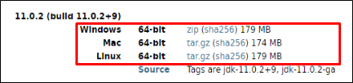
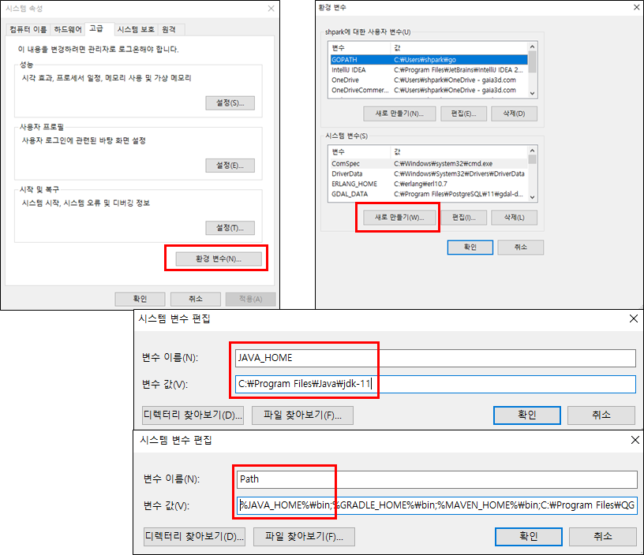
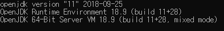

### 1. Java
### 1) Java 설치

- 자바설치 홈페이지(https://jdk.java.net/archive/)에 접속하여 Java를 구동하기 위한 환경에 해당하는 파일을 내려받는다.
- 내려 받은 압축 파일을 설치할 폴더에 압축 해제한다.




### 2) Java 환경변수 설정

- [제어판] → [시스템 및 보안] → [시스템] 또는 [내 PC]의 [속성]을 클릭 한 후, [고급 시스템 설정]을 클릭한다.

- [시스템 속성]의 [고급]탭 화면에서 [환경 변수]를 클릭한다.

- [환경변수] 화면에서 [새로 만들기]를 클릭하여, 변수 이름과 변수 값 입력란에 **JAVA_HOME**과 Java의 경로를 설정한다.
- Java 설치 경로를 설정 한 후, **시스템 변수의 [Path] 변수**를 선택하고 [편집] 버튼을 클릭한다.
- 제일 앞쪽에 **%JAVA_HOME%\bin;**을 입력하고 저장한다.



 

### 3) Java 설치 확인

- 명령 프롬프트 창을 실행시켜 아래와 같이 명령어 실행

```
1java -version
```



 
### 2. PostgreSQL/PostGIS
### 3. GDAL
### 4. GeoServer
### 5. F4D Converter
### 6. RabbitMQ
### 7. 기본 테이블 생성 및 패스워드 업데이트
### 8. 설정
### 9. 레이어 업로드 테스트
### 10. 3D 데이터 업로드 테스트
